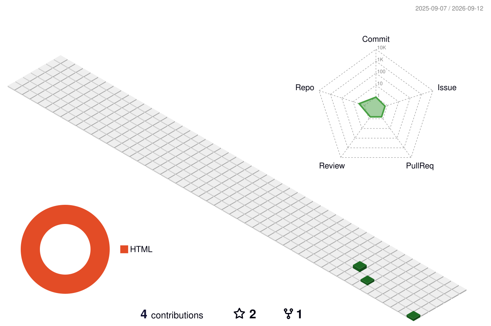

<!-- ============================== HERO ============================== -->

<picture>
  <source media="(prefers-color-scheme: dark)" srcset="https://capsule-render.vercel.app/api?type=waving&height=190&color=0:0d1117,50:1f6feb,100:58a6ff&section=header&text=walihaha&fontSize=48&fontColor=ffffff&fontAlignY=34&desc=Embodied%20AI%20%C2%B7%20Embedded%20Engineer%20%C2%B7%20Agent%20Enthusiast&descAlignY=58&descSize=16&animation=fadeIn" />
  
</picture>

 

 

## 🧭 关于我 · About

> 具身智能公司的嵌入式工程师，Agent 爱好者 —— 白天和 MCU、驱动、时序打交道，业余把 LLM Agent 接进真实的工作流与真实的机器里。让模型不只是"会聊天"，而是能**碰得到设备、用得上手**。

<table>
<tr>
<td width="50%" valign="top">

**🔧 主战场**

嵌入式固件 / 设备侧软件，以及设备与 Agent 之间的那层胶水

**🤖 折腾方向**

LLM Agent 工具链 · 编码助手远程化 · 机器人与运动学

</td>
<td width="50%" valign="top">

**🧠 工作方式**

读框架源码 → 复现问题 → 把踩过的坑沉淀成文档和工具

**🎯 当前关注**

让 agent 接进工程流程，而不只是停在对话框里

</td>
</tr>
</table>

## 🛠 技术栈 · Tech Stack

<picture>
  <source media="(prefers-color-scheme: dark)" srcset="https://skillicons.dev/icons?i=py,ts,js,cpp,cmake,pytorch,html,css,arduino,linux,git,docker&theme=dark&perline=12" />
  
</picture>

  

## 🧩 精选项目 · Featured

| 🏷️ 项目 | 📄 说明 | 🧬 语言 |
| --- | --- | --- |
| **[feishu-claude-code](https://github.com/walihaha/feishu-claude-code)** | 在飞书里远程驱动 Claude Code 的桥接服务 · WebSocket 长连接 / 多会话隔离 / 流式卡片 / 附件双向收发 | `TypeScript` |
| **[NoteForge](https://github.com/walihaha/NoteForge)** | 日报整理 + 技术知识沉淀的轻量笔记系统，自带 Web 管理界面，纯标准库零依赖 | `Python` `HTML` |
| **[2024-](https://github.com/walihaha/2024-)** | 嵌入式 & 机器人实践：并联机械臂逆解、汉字字库取模生成器 | `Python` |

 

### 🛠 feishu-claude-code — 飞书 × Claude Code 远程桥

<table>
<tr>
<td width="50%" valign="top">

- **无需公网 IP / 域名**
  飞书 WebSocket 长连接收消息，内网机器也能用
- **会话隔离**
  每个聊天 / 用户独立 Claude 子进程，上下文互不串扰
- **流式输出**
  Claude 输出实时更新到飞书卡片

</td>
<td width="50%" valign="top">

- **附件双向收发**
  图片 / 文件 / 音频 / 视频自动落地；`[[SEND_FILE:路径]]` 自动回传
- **访问控制**
  群聊白名单 · 用户白名单 · @ 触发限制 · `CLAUDE_WORKDIR` 约束范围
- **二次开发**
  基于 `Shaoruisun/feishu-claude-code`，做了本地化与子进程回收修复

</td>
</tr>
</table>

### 📚 NoteForge — 技术成长助手

<table>
<tr>
<td width="50%" valign="top">

- **日报整理**
  今日工作 / 遇到的问题 / 今日 Skills / 收获 / 待办
- **知识沉淀**
  背景 / 核心原理 / 关键知识点 / 实际应用 / 常见问题 / 最佳实践

</td>
<td width="50%" valign="top">

- **Web 管理界面**
  双栏浏览 · Markdown 实时渲染 · 内置编辑器 · 全文搜索
- **零依赖**
  仅用 Python 标准库 `http.server`，无需 Node / 数据库 / Docker

</td>
</tr>
</table>

### 🤖 2024- — 嵌入式 & 机器人实践

- **并联机械臂逆解** — 运动学逆解实现与接线说明（接线图需到代码里找）
- **汉字字库生成器** — 为点阵屏 / OLED 生成字模数据的 Python 工具

 

> 更多仓库见 👉 **[github.com/walihaha?tab=repositories](https://github.com/walihaha?tab=repositories)**

## 📊 数据 · Stats

<picture>
  <source media="(prefers-color-scheme: dark)" srcset="https://github-readme-stats.vercel.app/api?username=walihaha&show_icons=true&hide_border=true&include_all_commits=true&count_private=true&bg_color=0D1117&title_color=58A6FF&icon_color=58A6FF&text_color=C9D1D9&border_radius=12" />
  
</picture>
<picture>
  <source media="(prefers-color-scheme: dark)" srcset="https://github-readme-stats.vercel.app/api/top-langs/?username=walihaha&layout=compact&hide_border=true&langs_count=8&bg_color=0D1117&title_color=58A6FF&text_color=C9D1D9&border_radius=12" />
  
</picture>

<picture>
  <source media="(prefers-color-scheme: dark)" srcset="https://streak-stats.demolab.com?user=walihaha&hide_border=true&background=0D1117&ring=58A6FF&fire=F78166&currStreakLabel=58A6FF&sideLabels=58A6FF&currStreakNum=C9D1D9&sideNums=C9D1D9&dates=8B949E" />
  
</picture>

<picture>
  <source media="(prefers-color-scheme: dark)" srcset="https://github-readme-activity-graph.vercel.app/graph?username=walihaha&bg_color=0D1117&color=58A6FF&line=1F6FEB&point=C9D1D9&area=true&area_color=1F6FEB&hide_border=true&custom_title=Contribution%20Activity" />
  
</picture>

## 🐍 贡献 · Contribution

  <picture>
    <source media="(prefers-color-scheme: dark)" srcset="./profile-3d-contrib/profile-night-green.svg" />
    
  </picture>

  <picture>
    <source media="(prefers-color-scheme: dark)" srcset="https://raw.githubusercontent.com/walihaha/walihaha/output/github-contribution-grid-snake-dark.svg" />
    
  </picture>

## 📮 联系 · Contact

  

**让 agent 真正接进工程流程，而不只是停在对话框里。**

  

<picture>
  <source media="(prefers-color-scheme: dark)" srcset="https://capsule-render.vercel.app/api?type=waving&height=130&color=0:58a6ff,50:1f6feb,100:0d1117&section=footer" />
  
</picture>
